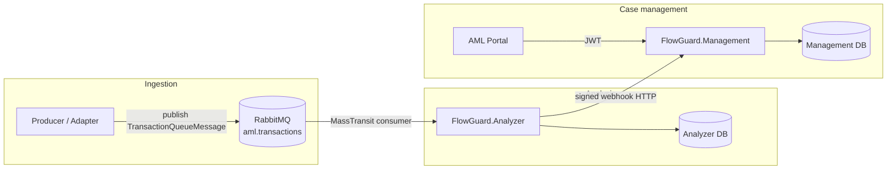

# FlowGuard — system architecture

This document explains how the major parts of FlowGuard fit together. **Product ownership and who operates the platform in production** are summarised in [masarat.md](./masarat.md) and [bank/governance-and-operations.md §2](./bank/governance-and-operations.md#2-operating-authority). For integration contracts and field-level APIs, use [BACKEND-INTEGRATION-GUIDE.md](./BACKEND-INTEGRATION-GUIDE.md) and OpenAPI on a running Analyzer or Management host.

## 1. System context

FlowGuard screens financial transactions for AML risk, applies institution-defined rules and statistical anomaly detection, and feeds **alerts** into a central **case management** API consumed by compliance analysts through the **AML Portal**.

External actors:

- **Transaction producers** — bank cores, wallet gateways, or adapters that publish `TransactionQueueMessage` to RabbitMQ (preferred) or call HTTP ingress where agreed.
- **Channel monitoring producers** — mobile or web security events posted to the Analyzer monitoring API (signed when enabled).
- **Analysts and administrators** — browser clients on the AML Portal, backed by the Management API.

## 2. Logical containers

| Container | Responsibility | Typical runtime |
|-----------|----------------|-----------------|
| **FlowGuard.Analyzer** | Validate and analyse transactions per configured **bank code**; rules + ML + watchlist logic; emit webhooks to Management; optional monitoring ingestion | One deployable instance per bank/tenant routing policy |
| **FlowGuard.Management** | Authentication, authorization, users, tenants, alerts, cases, reporting, subscription and ingestion credential administration | Shared central service |
| **AML Portal** | Angular SPA; operational UI | Static assets + API gateway to Management |
| **PostgreSQL** | Durable state for Management and per-Analyzer schemas as deployed | Managed or containerised |
| **RabbitMQ** | Topic exchanges for transactions (and optional monitoring queues) | Cluster or single node per environment |
| **Redis** | Caching layer for hot paths | Optional per deployment |
| **Consul** | KV configuration and discovery where enabled | Optional |
| **Observability stack** | OpenTelemetry collector, Prometheus, Loki, Tempo, Grafana | Sidecar or shared infra compose |

Repository layout for these services is under `src/Applications/` (hosts), `src/Services/` (domain libraries), `src/Core/` (shared models), `src/Clients/` (Analyzer client library).

## 3. Primary data flow — AML transaction

Design points:

- **Bank isolation** — Each Analyzer process is configured with a `TenantConfig:BankCode`. Envelope `BankCode` must match; mismatches are rejected (see consumer logs and DLQ runbook).
- **At-least-once delivery** — Message brokers may redeliver; Management and Analyzer idempotency rules (e.g. transaction id, ingestion receipts) must be respected. See [TENANT_INGESTION_KEYS.md](./TENANT_INGESTION_KEYS.md) for HTTP ingress metering and duplicate handling.
- **Legacy HTTP analyse paths** on the Analyzer remain for backward compatibility; new integrations should use the queue or supported ingress endpoints described in the integration guide.

### 3.1 Fraud screening, reviews, and case webhooks

Fraud checks run in **FlowGuard.Analyzer** in parallel with AML rules and ML. Fraud is **review-oriented** and does not replace AML typology or institutional risk policy. The Analyzer posts **FRAUD_REVIEW** (and other) alerts to **FlowGuard.Management** using the same signed **alert webhook** path as AML. Operators use the **AML Portal** for **Fraud reviews**, per-tenant **Fraud configuration**, and **Fraud calibration** under Reports. **Case** records can be created in Management when the Analyzer calls the **case webhook** (`POST` under `api/webhooks/.../case`), so investigator workflows stay in the Management database and portal.

## 4. Security boundaries

| Boundary | Mechanism |
|----------|-----------|
| Portal → Management | JWT bearer; role and permission policies on controllers |
| Management → external | TLS at edge; secrets from environment or Consul, not committed defaults |
| Analyzer → Management | Webhook HMAC and timestamp validation (see `WebhookSecurityService`) |
| Monitoring events → Analyzer | Optional HMAC on canonical payload when `SignatureValidation:Enabled` |
| Transaction HTTP ingress | API key or DB-backed ingestion keys per tenant configuration |

Detailed control checklist: [team-runbooks/security-runbook.md](./team-runbooks/security-runbook.md).

## 5. Observability

- **Metrics and traces** — Registered via shared observability bootstrap (`ObservabilityRegistration` in `src/BuildingBlocks/Observability/Telemetry/OpenTelemetry.cs`): W3C trace context and baggage propagators are set before ASP.NET Core and HTTP clients initialise.
- **Messaging** — MassTransit consumer and publisher paths emit structured logs and participate in trace propagation; see Analyzer consumer implementation for header extraction and span tags.
- **Dashboards** — Compose-defined Grafana, Prometheus, Loki, Tempo; see [team-runbooks/operations-runbook.md](./team-runbooks/operations-runbook.md).

## 6. Configuration surfaces

| Surface | Use |
|---------|-----|
| `appsettings.json` + environment variables | Local and container defaults |
| `deployment/docker-compose*.yml` | Service topology, ports, env injection |
| Consul KV | Production overrides; document keys in `deployment/CONSUL_KV_INGESTION_SUBSCRIPTION.md` for ingestion-related examples |

## 7. Frontend configuration note

The AML Portal reads runtime settings from `/assets/config.json` (generated at container startup in Docker). API logging and base URLs are controlled there; see portal `docker-entrypoint.sh` and deployment env vars.

## 8. Further reading

- [masarat.md](./masarat.md) — Masarat as product owner and platform operator
- [GLOSSARY.md](./GLOSSARY.md) — terminology
- [integrations/masarat-wallet-flowguard-integration.md](./integrations/masarat-wallet-flowguard-integration.md) — wallet contract
- [operations/aml-transaction-queue-runbook.md](./operations/aml-transaction-queue-runbook.md) — queue operations
