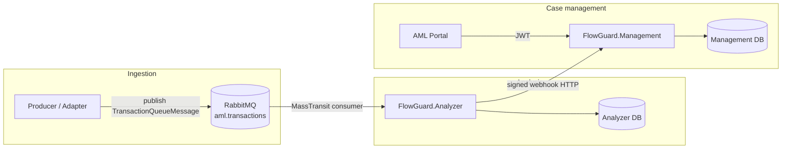

# FlowGuard — architecture built for real AML workloads

This document is the **technical backbone** of the story: how FlowGuard turns **ingested transactions** into **screening outcomes**, **alerts**, **fraud review**, and **case workflows** in a **multi-tenant**, **message-driven** architecture with **clear security boundaries** and **first-class observability**. **Who owns the product and runs it in production** is in [masarat.md](./masarat.md) and [bank/governance-and-operations.md §2](./bank/governance-and-operations.md#2-operating-authority). For field-level contracts and HTTP/queue details, use [BACKEND-INTEGRATION-GUIDE.md](./BACKEND-INTEGRATION-GUIDE.md) and OpenAPI on a running Analyzer or Management host.

## 1. System context — who plugs in, who gets value

FlowGuard is designed so **producers** can be loud (cores, **wallet** bridges, adapters) and **analysts** get a **calm, unified** portal: all screening feeds **alerts** into a central **case-management** API; compliance and fraud work happens in the **AML Portal** without re-wiring the bank’s entire stack for every new channel.

- **Producers** publish `TransactionQueueMessage` to **RabbitMQ** (the **default, scalable** path) or use **HTTP** ingress where contractually agreed.
- **Channel monitoring** (mobile / web **security** events) lands on the Analyzer monitoring API, **signed** when that path is enabled.
- **Analysts & admins** use the **AML Portal** in the browser; everything behind it is the **Management** API and policy layer.

**Why this shape wins:** decouple **ingest volume** from **UI scale** — the Analyzer and broker absorb spikes; Management and the portal stay the **authoritative** place for users, cases, and audit narrative.

## 2. Logical containers — what we actually run

| Component | What it does | How we deploy it |
|-----------|----------------|------------------|
| **FlowGuard.Analyzer** | Validates and **analyses** transactions per **bank code**; **rules + ML + watchlist**; **fraud** in parallel with AML; **signed webhooks** to Management; optional **monitoring** ingestion | Typically **per bank / tenant routing policy** — isolation is a **design feature**, not an afterthought |
| **FlowGuard.Management** | **AuthN/Z**, **users**, **tenants**, **alerts**, **cases**, **reporting**, **subscription & ingestion** administration | **Shared central** service — one place for operational truth |
| **AML Portal** | **Angular** SPA — the operational **face** of the product | Static assets + API path to Management |
| **PostgreSQL** | Durable state for Management and per-Analyzer **schemas** as deployed | Managed or containerised |
| **RabbitMQ** | **Topic** exchanges for transactions (and optional **monitoring** plumbing) | Cluster or node per environment |
| **Redis** | **Hot** caching | Optional per deployment |
| **Consul** | **KV** and discovery | Optional |
| **Observability** | **OpenTelemetry** collector, **Prometheus**, **Loki**, **Tempo**, **Grafana** | Same **compose / swarm** story as the apps — the stack is **observed**, not opaque |

Code layout: `src/Applications/` (hosts), `src/Services/`, `src/Core/`, `src/Clients/` — **clean separation** between deployable **hosts** and **reusable** domain and client libraries.

## 3. Primary data flow — AML transaction (the main event)

The diagram is the **happy path** from producer to case management. Everything else in the runbooks (retries, DLQ, HMAC) hangs off this spine.

**Design power:**

- **Bank isolation** — `TenantConfig:BankCode` on each Analyzer; envelope **must** match. Wrong bank? **Rejected** — not silently cross-contaminated (see consumer logs and [queue runbook](./operations/aml-transaction-queue-runbook.md)).
- **At-least-once** — the broker can **redeliver**; idempotency on **transaction id** and ingestion rules is **documented** ([TENANT_INGESTION_KEYS.md](./TENANT_INGESTION_KEYS.md) for HTTP ingress and duplicates).
- **Legacy HTTP** analyse routes remain for **compatibility**; new work should go **queue-first** or the **supported** ingress in the integration guide.

### 3.1 Fraud, reviews, and case webhooks

**Fraud** runs in the **Analyzer** **alongside** AML and ML. It is **review-driven** and does not replace your typology or policy — it **informs** the right people. **FRAUD_REVIEW** (and other) alerts go to **Management** on the same **signed alert webhook** path as AML. The **AML Portal** carries **Fraud reviews**, per-tenant **Fraud config**, and **Fraud calibration**. When the Analyzer hits the **case webhook** (`POST` under `api/webhooks/.../case`), **Case** records land in **Management** so **investigator workflows** stay in one system of record.

## 4. Security boundaries — defensible by design

| Boundary | Mechanism |
|----------|-----------|
| Portal → Management | **JWT** bearer; **roles** and **policies** on controllers |
| Management → edge | **TLS**; secrets from **env** or **Consul** — not baked defaults in repo |
| Analyzer → Management | **Webhook HMAC** + **timestamp** validation (`WebhookSecurityService`) |
| Monitoring → Analyzer | Optional **HMAC** on the canonical payload when `SignatureValidation:Enabled` |
| Transaction HTTP ingress | **API key** or **DB-backed** ingestion keys per **tenant** |

Deeper hardening: [team-runbooks/security-runbook.md](./team-runbooks/security-runbook.md).

## 5. Observability — you can see what it did

- **Metrics & traces** — `ObservabilityRegistration` in `src/BuildingBlocks/Observability/Telemetry/OpenTelemetry.cs`: **W3C** trace context and **baggage** before ASP.NET Core and **HTTP** clients start.
- **Messaging** — MassTransit paths emit **structured logs** and **propagate** trace context (see Analyzer consumer for headers and span tags).
- **Dashboards** — Grafana / Prometheus / Loki / Tempo from compose; [operations runbook](./team-runbooks/operations-runbook.md) ties it to **how you run** the stack.

**Why it matters in production:** a compliance stack that cannot be **traced** and **tuned** under load is a liability. FlowGuard is built so **SRE and auditors** can follow the **thread** from ingress to case.

## 6. Configuration — envs, compose, Consul

| Surface | Use |
|---------|------|
| `appsettings.json` + **env** | Local and container **defaults** |
| `deployment/docker-compose*.yml` | **Topology**, ports, **injected** config |
| **Consul KV** | Production **overrides**; ingestion keys described in `deployment/CONSUL_KV_INGESTION_SUBSCRIPTION.md` |

## 7. Frontend note

The **AML Portal** loads `/assets/config.json` at **container** startup (see `docker-entrypoint` and deployment env) — so **per-environment** API and logging are **not** a rebuild for every target.

## 8. Further reading

- [masarat.md](./masarat.md) — product owner and platform operator
- [GLOSSARY.md](./GLOSSARY.md) — shared vocabulary
- [integrations/masarat-wallet-flowguard-integration.md](./integrations/masarat-wallet-flowguard-integration.md) — wallet contract
- [operations/aml-transaction-queue-runbook.md](./operations/aml-transaction-queue-runbook.md) — queue operations in depth
