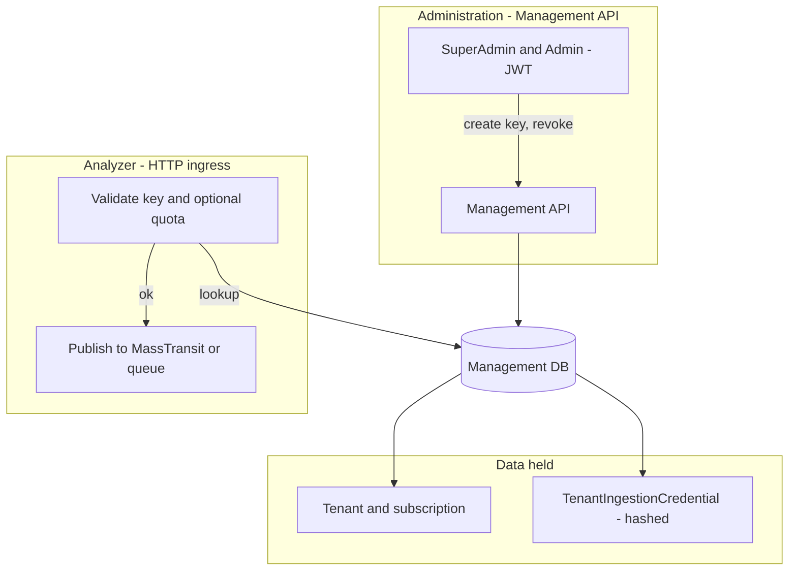
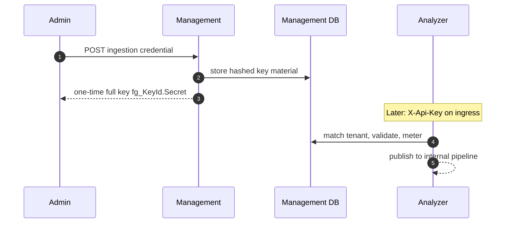

# Tenant subscriptions & ingestion (wallet) API keys

**Platform context:** **Masarat** operates the Management and Analyzer **services** that enforce these keys; subscription and metering **policy** is implemented in product as documented below. **Governance** of keys on the **bank** side (who may issue, rotate, audit) remains with the **institution**—see [masarat.md](./masarat.md) and [bank/governance — §2](./bank/governance-and-operations.md#2-operating-authority).

## Configuration (all environments)

| Setting | Where | Purpose |
|--------|--------|---------|
| `Ingestion:KeyPepper` | Management + **every** Analyzer | Shared secret used to hash ingestion key secrets. **Must match** across services that validate keys. |
| `Subscription:EnforceOnIngress` | Analyzer | When `true`, ingress checks active subscription + monthly quota and increments usage. When `false`, keys are still validated but quota is not enforced (useful for rollout). |
| `INGESTION_KEY_PEPPER` | Env (optional) | Overrides / sets pepper if your host injects env vars. |
| `SUBSCRIPTION_ENFORCE_ON_INGRESS` | Env (optional) | `true` / `false` override for Analyzer. |
| `ConnectionStrings:ManagementDb` | Analyzer | Same DB as Management so Analyzer can resolve `TenantIngestionCredential` rows. |
| `TransactionIngress:ApiKey` | Analyzer (optional) | **Legacy** break-glass static key; if set and `RequireApiKey` is true, this value is accepted before DB-backed keys. |

If you use Consul KV for production settings, mirror the same keys as in `docker-compose` / appsettings. Example key paths and JSON fragments: `deployment/CONSUL_KV_INGESTION_SUBSCRIPTION.md`.

### Architecture: tenants, keys, and where they live

**Management** is the **system of record** for **tenants**, **subscription plans**, and **ingestion credentials** (hashed secrets in **Management DB**). The **Analyzer** uses the same database connection to validate **HTTP** `X-Api-Key` traffic and, when enabled, **subscription and quota** before a message is published to MassTransit.



**Key lifecycle (issue to first transaction):**



## Ingress metering (Analyzer)

The Analyzer validates the key **before** publishing to MassTransit, then **commits** `LastUsedAt` and monthly `TenantSubscriptionUsage` **only after** a successful publish. If publish fails, usage is not incremented.

**Idempotency (DB-backed keys):** Retries with the same JSON `transactionId` and tenant resolve to the same Management row: before publish, if a `TenantIngressReceipt` already exists for `(tenantId, transactionId)`, the API returns **202** with `duplicate: true` and the original `messageId` without re-publishing or re-metering. After publish, commit inserts that receipt in the same database transaction as the usage increment, so concurrent duplicate commits only meter once. Downstream consumers may still see duplicate queue messages if two requests race before either commit completes; design consumers to tolerate at-least-once delivery on `transactionId` if needed.

## Key format

Issued keys look like:

`fg_{KeyId}.{Secret}`

Send the full string in the HTTP header:

`X-Api-Key: fg_....`

## Management API (JWT)

Base path: `/api/v1` on the Management service.

- `GET /SubscriptionPlans` — SuperAdmin; catalog.
- `GET /SubscriptionPlans/{planId}` — SuperAdmin; single plan.
- `GET /Tenant/{tenantId}/subscription/current` — SuperAdmin, Admin (own tenant only).
- `POST /Tenant/{tenantId}/subscription` — SuperAdmin; assign plan.
- `PATCH /Tenant/{tenantId}/subscription/{subscriptionId}` — SuperAdmin.
- `GET /Tenant/{tenantId}/ingestion-credentials` — SuperAdmin, Admin (own tenant).
- `POST /Tenant/{tenantId}/ingestion-credentials` — body `{ "name": "..." }`; returns one-time `apiKey`.
- `POST /Tenant/{tenantId}/ingestion-credentials/{credentialId}/revoke` — `204` on success.

### JWT “current tenant” (no tenant id in URL)

For **Admin** (and SuperAdmin with `tenant_id` in the JWT), the same operations are exposed without putting a tenant GUID in the path:

- `GET /Tenant/current/subscription/current`
- `GET /Tenant/current/ingestion-credentials`
- `POST /Tenant/current/ingestion-credentials`
- `POST /Tenant/current/ingestion-credentials/{credentialId}/revoke`

SuperAdmin **without** a tenant claim receives **403** on these routes (use the explicit `/Tenant/{tenantId}/…` URLs from Tenant Management).

## Audit (Management)

The following actions are written via `IAuditLoggingService.LogAdminActionAsync` with JSON details (never the raw API key): `IngestionCredentialCreated`, `IngestionCredentialRevoked`, `TenantSubscriptionAssigned`, `TenantSubscriptionCancelled`.

## AML Portal

- **SuperAdmin:** Tenant Management → key icon on a row → **Billing & ingestion API keys** (plans + keys).
- **Admin:** sidebar **Ingestion API keys** → manage keys for the logged-in tenant (read-only subscription summary).

## Manual E2E (curl)

1. Create a key in Management (Portal or API); copy `apiKey`.
2. Post a minimal transaction to the Analyzer ingress route you use in production (example path may vary):

```bash
curl -sS -X POST "https://<analyzer-host>/api/v1/TransactionQueueIngress/transactions" ^
  -H "Content-Type: application/json" ^
  -H "X-Api-Key: fg_YOUR_KEY_HERE" ^
  -d "{\"amount\":1,\"currency\":\"USD\"}"
```

3. Expect `401`/`403` with JSON if the key is wrong, revoked, subscription blocked, or quota exceeded (when enforcement is on). Expect success when valid and within quota.

Adjust URL and JSON body to match your deployment’s ingress contract.
