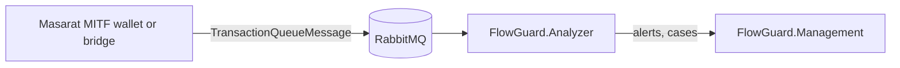

# Masarat Wallet → FlowGuard AML integration contract

**Masarat** is both the **author** of this contract and the **operator** of the FlowGuard **platform** that ingests and screens traffic ([masarat.md](../masarat.md)). The **Masarat MITF wallet** (or a bridge) publishes transactions; the **bank** is the **business tenant** on screened data. This page defines the **AML-owned** technical contract for ingesting transaction monitoring data from external systems. The wallet repository may implement a bridge later; FlowGuard does not require wallet code changes to accept correctly formed messages.

## Preferred transport

| Transport | Use case |
|-----------|----------|
| **RabbitMQ (topic exchange)** | **Primary.** Decouples producers from the analyzer, supports retries and DLQ. |
| HTTP ingress | **Optional.** `POST /api/v1/TransactionQueueIngress/transactions` on FlowGuard.Analyzer when partners cannot publish to RabbitMQ (see [HTTP ingress](#optional-http-ingress)). |
| Legacy `TransactionAnalysis` HTTP | Deprecated; kept for backward compatibility only. |

**Integration shape (not to scale):**



## RabbitMQ topology

**Authoritative reference:** [Backend integration guide — Part A, RabbitMQ](../BACKEND-INTEGRATION-GUIDE.md#recommended-rabbitmq-masstransit-consumer) (and `src/Applications/FlowGuard.Analyzer/appsettings.json` in the platform repository). **Operations** (retries, TTL, DLQ triage, manual verification): [aml-transaction-queue runbook](../operations/aml-transaction-queue-runbook.md).

**Bridge/producer permissions:** need **only publish** to exchange `aml.transactions` with routing key `transaction.{BankCode}` — not read access to the analyzer’s consumer queues.

**PII:** do not put sensitive personal data in exchange, queue, or routing key strings beyond the bank code.

## Message envelope: `TransactionQueueMessage`

Defined in `src/Core/FlowGuard.Core/Models/TransactionQueueMessage.cs` in the platform repository.

| Field | Required | Description |
|-------|----------|-------------|
| `MessageId` | Yes | Unique id for the message (retry/idempotency correlation). |
| `Timestamp` | Yes | UTC when the message was created. |
| `BankCode` | Yes | Must match the analyzer instance `TenantConfig:BankCode`. Mismatch is **rejected** by the consumer (see `src/Applications/FlowGuard.Analyzer/Consumers/MassTransitTransactionQueueConsumer.cs`). |
| `CorrelationId` | No | End-to-end trace; prefer OpenTelemetry trace id when available. |
| `MessageVersion` | Yes | Schema version; currently `1.0`. Add fields in backward-compatible ways only. |
| `RoutingKey` | No | If set, should equal `transaction.{BankCode}` for publishers using MassTransit send topology. |
| `RetryCount` | No | Populated by infrastructure on retries. |
| `Transaction` | Yes | Nested `TransactionAnalysisRequest`. |

## Payload: `TransactionAnalysisRequest`

Validated by `src/Applications/FlowGuard.Analyzer/Validation/TransactionAnalysisRequestValidator.cs` before processing.

### Wallet-oriented field usage

| Field | Wallet mapping guidance |
|-------|-------------------------|
| `TransactionId` | Stable string id for idempotency. Use the wallet transaction **GUID** string (max 100 chars). |
| `AccountNumber` | **Required.** Sender side: wallet id GUID string or resolved customer account id (max 50). |
| `BeneficiaryAccount` | Counterparty wallet id for transfers; optional for single-sided flows. |
| `Amount` | **Must be &gt; 0.** Do not send negative amounts; represent reversals with a dedicated `TransactionType` (e.g. `WALLET_REVERSAL`) and positive amount, or a separate integration phase. |
| `Currency` | ISO 4217, **three uppercase letters** (e.g. `LYD`). |
| `TransactionDate` | UTC event time; must not be default; allowed up to ~5 minutes in the future for clock skew. |
| `BankCode` / `CustomerBankCode` | Must align with `TenantConfig:BankCode` for this analyzer (see `src/Services/FlowGuard.Services.Analyzer/Services/Analysis/AnalyzerAMLService.cs`). |
| `TransactionType` | Use a consistent vocabulary (see below). |
| `Channel` | Use `WALLET` for wallet-originated traffic (see vocabulary below). |
| `CorrelationId` | Wallet or gateway trace id. |
| `Description` | Optional tag, e.g. `source=mitf_wallet` for filtering in rules. |
| `ProductId` | Optional product or flow identifier if rules need it. |

### Channel and transaction type vocabulary (wallet)

Use these **exact** strings (uppercase) for segmentation in rules and reporting:

**`Channel`**

- `WALLET` — default for Masarat wallet-originated monitoring.

**`TransactionType`**

- `WALLET_TRANSFER` — wallet-to-wallet transfer completed.
- `WALLET_FUND` — wallet funded / top-up.
- `MERCHANT_PAYMENT` — merchant payment completed (dedicated score in `TransactionTypeRiskScores`; distinct from generic `PAYMENT`).
- `CASH_WITHDRAWAL` — use existing `CASH_WITHDRAWAL` score for wallet cash-out flows.
- `WALLET_REVERSAL` — reversal posted (use with positive `Amount` and metadata in `Description` if needed).

Risk weights for these types are configured under `AnomalyDetection:TransactionTypeRiskScores` in appsettings.

## Idempotency

- **Business key:** `TransactionId` must be stable across retries.
- **Persistence:** FlowGuard upserts by `TransactionId` (`src/Services/FlowGuard.Services.Analyzer/Services/Analysis/AnalyzerAMLService.cs` in the platform repo); duplicate messages update analysis results for the same id.

## Versioning

- Bump `MessageVersion` only when introducing breaking envelope changes.
- Prefer additive optional fields on `TransactionAnalysisRequest` coordinated with Management UI and rules.

## Optional HTTP ingress

When RabbitMQ is not available to the producer, FlowGuard.Analyzer can expose a secured endpoint that **enqueues** the same `TransactionQueueMessage` to the exchange (async path identical to queue publishing). See [aml-transaction-queue-runbook.md](../operations/aml-transaction-queue-runbook.md) and `TransactionIngress` in appsettings.

**Signature validation:** `SignatureValidation` in appsettings applies to **Masarat monitoring mobile ingestion**, not to the wallet Rabbit contract or to the optional HTTP ingress (which uses `TransactionIngress:ApiKey` when enabled).

## Automated tests (AML repo)

Contract coverage lives in `FlowGuard.Services.Analyzer.Tests`: JSON round-trip (`TransactionQueueMessageJsonContractTests`), payload bank routing (`AnalyzerAMLServiceBankRoutingTests`), queue consumer envelope routing (`MassTransitTransactionQueueConsumerTests`), and validator cases (`TransactionAnalysisRequestValidatorTests`).

## JSON example (wallet-shaped)

```json
{
  "messageId": "550e8400-e29b-41d4-a716-446655440000",
  "timestamp": "2026-04-15T12:00:00Z",
  "bankCode": "JUMHORIA",
  "correlationId": "trace-from-wallet",
  "messageVersion": "1.0",
  "routingKey": "transaction.JUMHORIA",
  "transaction": {
    "transactionId": "a1b2c3d4-e5f6-7890-abcd-ef1234567890",
    "accountNumber": "11111111-1111-1111-1111-111111111111",
    "beneficiaryAccount": "22222222-2222-2222-2222-222222222222",
    "amount": 1500.00,
    "currency": "LYD",
    "transactionDate": "2026-04-15T12:00:00Z",
    "transactionType": "WALLET_TRANSFER",
    "bankCode": "JUMHORIA",
    "customerBankCode": "JUMHORIA",
    "channel": "WALLET",
    "description": "source=mitf_wallet"
  }
}
```
