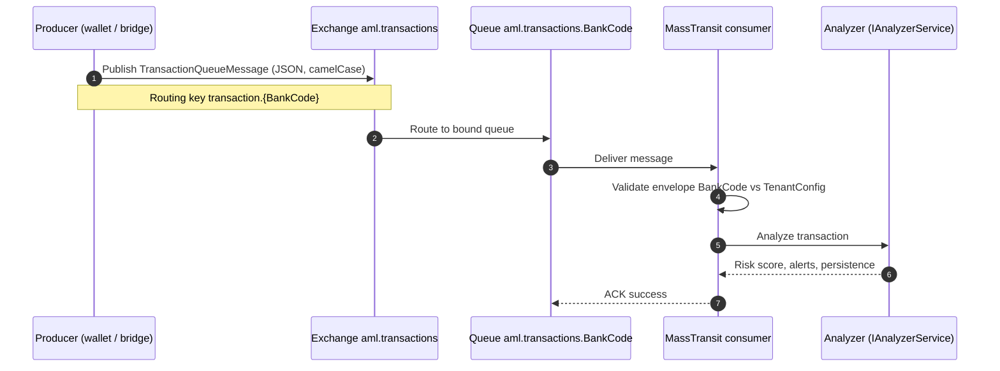
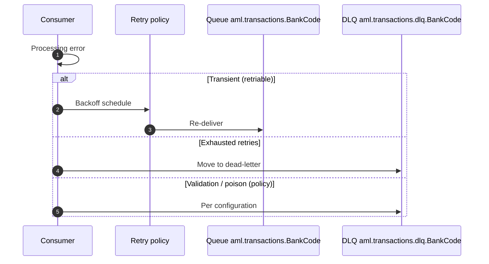

# AML transaction queue operations runbook

Operational guidance for RabbitMQ-backed transaction ingestion in FlowGuard.Analyzer (`TransactionQueue`, MassTransit consumer, DLQ). **Platform operator:** **Masarat** runs the **broker binding and consumer** configuration in production; this runbook is the engineering reference for topology and triage.

## Message flow (happy path)

The diagram below is the **nominal** path: a producer publishes a `TransactionQueueMessage` envelope; the analyzer consumer validates the tenant `BankCode`, runs analysis, and acknowledges the message.



## Retry, NACK, and dead-letter

On **transient** failures, MassTransit retries with exponential backoff (`TransactionQueue:RetryDelayMs`). After **`MaxRetryAttempts`**, messages move to the **DLQ** `aml.transactions.dlq.{BankCode}`. **Validation / poison** paths (e.g. bank mismatch) are configured not to retry indefinitely—confirm behaviour in logs and DLQ policy for your release.



## Components

| Component | Role |
|-----------|------|
| Exchange `aml.transactions` | Topic exchange; producers publish here. |
| Queue `aml.transactions.{BankCode}` | Analyzer consumer binding; one queue per bank instance. |
| DLQ `aml.transactions.dlq.{BankCode}` | Dead-letter queue after retry exhaustion (see `x-dead-letter-*` on main queue). |
| `MassTransitTransactionQueueConsumer` | Consumes `TransactionQueueMessage`, validates envelope `BankCode`, calls `IAnalyzerService`. |

Configuration: `src/Applications/FlowGuard.Analyzer/Configuration/TransactionQueueOptions.cs`, `src/Applications/FlowGuard.Analyzer/appsettings.json` (platform repository).

## Retry behavior

- MassTransit `UseMessageRetry` with exponential backoff using `TransactionQueue:RetryDelayMs` (default `[1000, 2000, 4000]`).
- `MaxRetryAttempts` caps retries before DLQ.
- `InvalidOperationException` (e.g. bank code mismatch on envelope) is configured not to retry indefinitely—treat as **poison** after policy; verify logs and DLQ.

## DLQ monitoring (recommended)

1. **Queue depth:** Alert when `aml.transactions.dlq.{BankCode}` message count &gt; 0 sustained, or above a threshold.
2. **Primary queue lag:** Alert when `aml.transactions.{BankCode}` consumer lag grows (messages not acknowledged).
3. **Logs:** Search for `Rejecting transaction`, `Validation error processing transaction message`, `Error processing transaction message`.
4. **Health:** `/health` includes `RabbitMq` check (degraded if broker unreachable—see `src/Applications/FlowGuard.Analyzer/Program.cs` in the platform repository).

## RabbitMQ credentials and TLS (production)

- Use **dedicated** users: producers need **write** to `aml.transactions`; analyzer host needs **read** from its queue and **configure** on its queues as deployed.
- **Least privilege:** do not share admin credentials with bridge services.
- **TLS:** Set `MasaratMonitoring:RabbitMq:UseSsl` to `true` and configure `SslServerName` when the broker uses TLS; matches host SSL configuration in `src/Applications/FlowGuard.Analyzer/Program.cs`.
- **Virtual host:** Align `VirtualHost` across producers and analyzer.

## Message TTL

- `TransactionQueue:MessageTtlHours` sets `x-message-ttl` on the receive queue (default 24 hours). Adjust if messages must persist longer during outages.

## Optional HTTP ingress

When `TransactionIngress:Enabled` is true, the Analyzer exposes a secured endpoint that publishes to the same exchange as the queue path. **DB-backed keys** (`fg_*` format), subscription metering, and revocation: [TENANT_INGESTION_KEYS.md](../TENANT_INGESTION_KEYS.md). Rotate any legacy static `TransactionIngress:ApiKey` regularly; restrict network access where possible.

## Incident checklist

1. Confirm RabbitMQ cluster reachable from analyzer and producers.
2. Verify `TenantConfig:BankCode` matches published `TransactionQueueMessage.BankCode` and routing key `transaction.{BankCode}`.
3. Inspect DLQ for poison messages; fix payload or routing; re-publish if needed.
4. Check analyzer DB and Management webhooks if alerts/cases missing after successful consume.

---

## Manual verification (engineering)

Use this section to confirm queue wiring after a deployment or broker change. Replace `TEJARI` with the Analyzer instance `TenantConfig:BankCode`.

### Prerequisites

- RabbitMQ reachable from your machine or from a jump host with `rabbitmqadmin` / management UI.
- Analyzer running with `TransactionQueue` enabled and MassTransit consumer registered.
- Management running if you need end-to-end alert visibility.

### Publish a minimal valid envelope

Publish to exchange `aml.transactions` with routing key `transaction.TEJARI`. Body must deserialize to `TransactionQueueMessage` (camelCase JSON). Minimal example:

```json
{
  "messageId": "00000000-0000-4000-8000-000000000001",
  "timestamp": "2026-04-26T12:00:00Z",
  "bankCode": "TEJARI",
  "retryCount": 0,
  "correlationId": "manual-test",
  "messageVersion": "1.0",
  "transaction": {
    "transactionId": "MANUAL-TEST-001",
    "accountNumber": "ACC-MANUAL-001",
    "amount": 1000.0,
    "currency": "LYD",
    "transactionDate": "2026-04-26T12:00:00Z"
  }
}
```

Full field requirements and wallet vocabulary: [BACKEND-INTEGRATION-GUIDE.md](../BACKEND-INTEGRATION-GUIDE.md), [integrations/masarat-wallet-flowguard-integration.md](../integrations/masarat-wallet-flowguard-integration.md).

### Expected Analyzer logs (Serilog)

| Stage | Message pattern (template) |
|-------|----------------------------|
| Trace extraction | `Extracted trace context from MassTransit headers...` (when parent trace headers present) |
| Consume start | `Processing transaction message {MessageId} (Retry: {RetryCount}) from queue...` |
| Success | `Transaction {TransactionId} processed successfully. RiskScore: {RiskScore}, Alerts: {AlertCount}...` |
| Bank mismatch | `Rejecting transaction {TransactionId} for wrong bank. Expected: {Expected}, Got: {Actual}...` then `Validation error processing transaction message...` |
| Transient failure | `Error processing transaction message {MessageId} (Retry: {RetryCount})` — MassTransit retries then DLQ per policy |

### DLQ and retries

1. To observe retries, temporarily force an error inside analysis (non-production) or disconnect a downstream dependency and restore it; watch retry count and backoff in logs.
2. After `MaxRetryAttempts`, confirm messages land on `aml.transactions.dlq.{BankCode}`.
3. **InvalidOperationException** (e.g. bank code mismatch) is treated as validation failure; confirm it does not retry indefinitely and surfaces in logs/DLQ per configuration.

### Common failures

| Symptom | Check |
|---------|--------|
| No consume activity | Binding: routing key must match `transaction.{BankCode}`; queue name `aml.transactions.{BankCode}` on the correct vhost. |
| Deserialize errors | JSON property names (camelCase), required envelope fields, `messageVersion`. |
| Unknown risk / no analysis | `BankCode` on transaction vs configured tenant; see Analyzer AML service behaviour in integration guide. |
