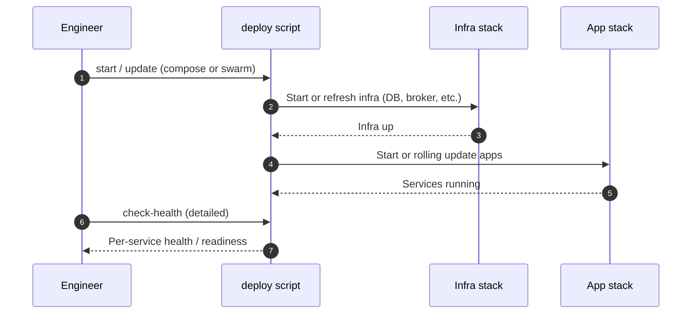

# Deployment Runbook

This runbook is for release and platform engineers deploying the AML System. **Default model:** **Masarat** leads production **releases and rollbacks**; bank staff may use the same procedures in **UAT** or as contractually shared—see [masarat.md](../masarat.md).

## Release sequence (high level)

**Compose / Swarm** details vary by host; the sequence below is the **logical** order for a rolling update. Always run `check-health` after changes.



## 1) Deployment Modes

### Compose mode (single host / simpler operations)

- Infra: `deployment/docker-compose.infra.yml`
- Apps: `deployment/docker-compose.production.yml`

### Swarm mode (orchestrated / replicated services)

- Infra: `deployment/docker-compose.swarm.infra.yml`
- Apps: `deployment/docker-compose.swarm.production.yml`

## 2) Prerequisites

- Docker Engine and Docker Compose v2 installed.
- Required ports available on target host(s).
- Deployment variables prepared (especially credentials and secrets).
- Change ticket approved and rollback plan ready.

## 3) Initial Setup

Run from `deployment/`.

### Linux/macOS

```bash
chmod +x setup.sh deploy.sh check-health.sh cleanup.sh
./setup.sh --mode swarm --auth-provider simplejwt
```

### Windows PowerShell

```powershell
.\setup.ps1 -Mode swarm -AuthProvider simplejwt
```

`setup` generates/updates deployment environment values (notably `deployment/.env`).

## 4) Standard Release Procedure

### Start/Update

Linux/macOS:

```bash
./deploy.sh start --mode swarm --auth-provider simplejwt
./check-health.sh --detailed
```

Windows PowerShell:

```powershell
.\deploy.ps1 -Action start -Mode swarm -AuthProvider simplejwt
.\check-health.ps1 -Detailed
```

### Status and logs

For day-to-day `deploy` status and log tailing, use the same commands as in [operations-runbook.md](./operations-runbook.md#3-standard-commands).

## 5) Deployment Validation Checklist

- All required containers/services are running.
- Health checks pass for management and analyzer services.
- Portal can call management API successfully.
- Database connectivity is healthy.
- RabbitMQ and Redis are reachable from analyzers/adapters.
- Logs show no startup crash loops.
- Telemetry visible in Grafana/Prometheus.

## 6) Rollback Strategy

Use a conservative rollback path:

1. Stop newly deployed services.
2. Redeploy last known-good image tags/config values.
3. Re-run health checks.
4. Validate business-critical transactions and alert flow.

If the release included schema/data changes, confirm backward compatibility before image rollback.

## 7) Destructive Actions Policy

`cleanup.sh` / `cleanup.ps1` may remove containers, networks, and volumes. Treat as a break-glass action, not a routine rollback step.

## 8) Configuration and Secrets Inputs

Primary deployment inputs:

- `deployment/.env` (generated/managed by setup scripts)
- `deployment/production-config.json`
- compose files in `deployment/docker-compose*.yml`

High-priority variables to validate before each release:

- JWT settings (`SIMPLE_JWT_*`)
- database credentials (`POSTGRES_*`, `ConnectionStrings__*`)
- messaging settings (RabbitMQ variables)
- config service address (`CONSUL_ADDRESS`)
- portal API base URL (`API_BASE_URL`)

## 9) Post-Deployment Handover

Provide operations and security teams with:

- deployed image tags
- exact deploy command used
- health check output summary
- known issues/workarounds
- rollback command path and owner
