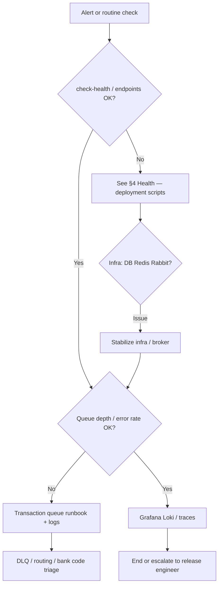

# Operations Runbook

This runbook is for the operations team responsible for day-to-day reliability, observability, and incident handling. **Who runs it:** in production, **Masarat** operates the FlowGuard platform; this document describes the stack and triage **behaviour**—see [masarat.md](../masarat.md).

## Operations and triage (overview)

Use this as a **mental model** for day-2: health checks first, then infrastructure, then application queues and logs.



## 1) System Overview

Core infrastructure services are defined in:

- `deployment/docker-compose.infra.yml`
- `deployment/docker-compose.swarm.infra.yml`

Core application services are defined in:

- `deployment/docker-compose.production.yml`
- `deployment/docker-compose.swarm.production.yml`

Primary services to monitor:

- Infrastructure: PostgreSQL, Redis, RabbitMQ, Consul, Loki, Tempo, Prometheus, Grafana, OTEL Collector
- Applications: AML Management API, AML analyzers (Tejari, Sahara, Jumhoria), mock adapters, AML portal

## 2) Daily Operations Checklist

- Confirm all containers/services are healthy.
- Verify API health endpoints return success.
- Check error rates and queue backlog.
- Review logs for repeated exceptions/timeouts.
- Validate observability pipeline (logs/metrics/traces) is receiving data.
- Confirm disk usage and Docker volume growth are within limits.

## 3) Standard Commands

Run from repository root.

### Linux/macOS

```bash
cd deployment
./deploy.sh status
./check-health.sh --detailed
./deploy.sh logs
```

### Windows PowerShell

```powershell
cd deployment
.\deploy.ps1 -Action status
.\check-health.ps1 -Detailed
.\deploy.ps1 -Action logs
```

## 4) Health and Readiness

Application health endpoints in code:

- Management: `/health` (`src/Applications/FlowGuard.Management/Program.cs`)
- Analyzer: `/health` (`src/Applications/FlowGuard.Analyzer/Program.cs`)

Use:

- `deployment/check-health.sh`
- `deployment/check-health.ps1`

as the first triage command during incidents.

## 5) Monitoring and Observability

Observability stack configuration:

- `deployment/infra/prometheus.yml`
- `deployment/infra/otel-collector-config.yaml`
- `deployment/infra/tempo.yaml`
- `deployment/infra/grafana/datasources.yaml`

Default local access endpoints (environment-dependent):

- Grafana: `http://localhost:3000`
- Prometheus: `http://localhost:9090`
- RabbitMQ Management: `http://localhost:15672`
- Consul UI: `http://localhost:8500`

### Distributed tracing

- **HTTP:** ASP.NET Core and `HttpClient` instrumentation propagate W3C `traceparent` when enabled in the observability options.
- **RabbitMQ / MassTransit:** The Analyzer registers MassTransit instrumentation where configured; the transaction consumer also extracts/injects trace context from message headers and tags spans (`messaging.system`, `messaging.message_id`, etc.). View linked traces in **Tempo** from Grafana.
- **Propagator:** The shared bootstrap sets `TraceContextPropagator` and `BaggagePropagator` before service construction (`ObservabilityRegistration` in `src/BuildingBlocks/Observability`).

Operational priorities:

- Alert on service down/unhealthy state.
- Alert on high API 5xx rates.
- Alert on RabbitMQ queue growth and message age.
- Alert on PostgreSQL connection saturation and storage pressure.
- Alert on missing telemetry (OTEL/Loki ingestion drop).

## 6) Troubleshooting Flow

1. Detect impact (what users/services are affected).
2. Run health scripts and collect failing service names.
3. Inspect recent logs for affected services.
4. Confirm dependencies for that service (DB/Redis/RabbitMQ/Consul).
5. Restart only impacted services first; avoid full-stack restarts unless required.
6. Verify recovery using health script and dashboard metrics.
7. Document timeline, root cause, and corrective action.

## 7) Persistence and Recovery Notes

Data persistence relies on Docker volumes declared in compose files:

- `deployment/docker-compose.infra.yml`
- `deployment/docker-compose.production.yml`
- swarm equivalents

Important:

- `cleanup.sh` / `cleanup.ps1` can remove volumes and destroy data.
- Treat cleanup as destructive and use only with explicit approval/change ticket.

No dedicated backup/restore automation script is currently present in `deployment/`. Establish scheduled PostgreSQL backup/restore procedures before production go-live.

## 8) Incident Documentation Minimum

For each incident record:

- start/end timestamps
- impacted services
- customer/user impact summary
- root cause
- immediate remediation
- prevention action items with owner and due date
